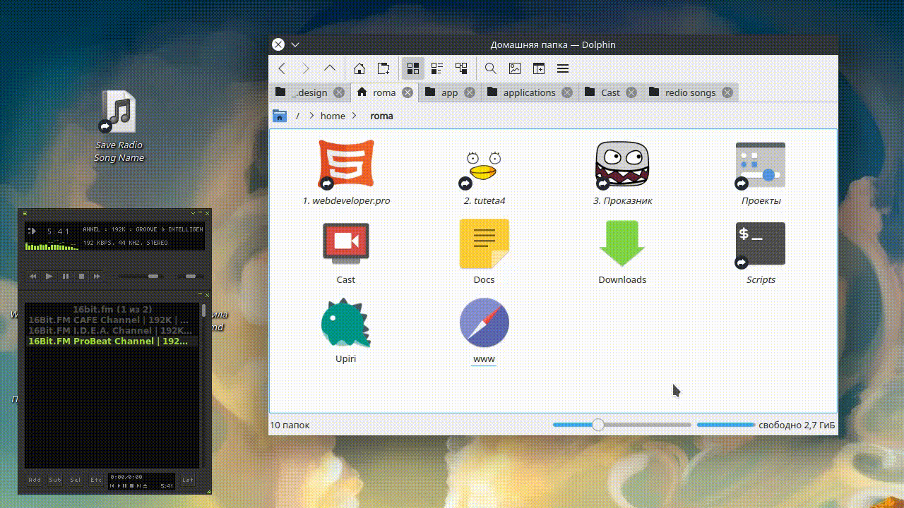

# Audacious - Save current radio song name

Just click the shortcut and get saved song name to txt or markdown file:



Then, after download the songs, you can add new section at top. And songs names will be saved in it.


Reason to leave downloaded songs in file is disable to add same song in feature.

Sections work just in markdown mode.

For work with markdown files you can use [https://typora.io/](https://typora.io/).

## Prerequisites

[Install Node.js](https://nodejs.org/en/download/package-manager/#debian-and-ubuntu-based-linux-distributions-enterprise-linux-fedora-and-snap-packages)

## Install

Clone the repository to some directory

```shell
git clone https://github.com/mavlutovr/audacious--save-current-radio-song-name.git
```

Go to cloned directory and install dependencies

```shell
cd audacious--save-current-radio-song-name
npm install
```

## Configure

Create a config file;

```shell
cp config/default.yaml config/local.yaml
```

Modify config file:

```shell
nano config/local.yaml
```

## Create a shortcut

Create a desktop file

```shell
cd ~/.local/share/applications/
nano audacious--save-current-radio-song-name.desktop
```

with content:

```shell
[Desktop Entry]
Encoding=UTF-8
Exec=npm start
Icon=stock_playlist
Name=Save Radio Song Name
StartupNotify=true
Terminal=false
TerminalOptions=
Type=Application
Version=1.0
X-DBUS-ServiceName=
X-DBUS-StartupType=
X-KDE-SubstituteUID=false
X-KDE-Username=

# PATH TO CLONED DIRECTORY
Path=/home/roma/www/audtool-save-current-track-name
```


### Run

1. Open Audacious.
2. Run "Save Radio Song Name" from your OS menu.